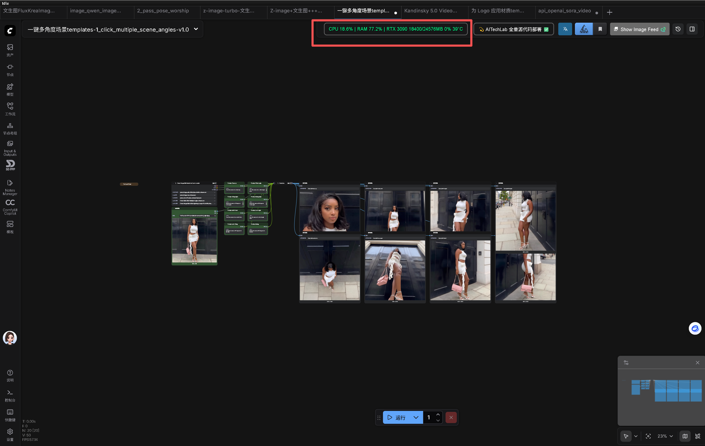

# ComfyUI-TorchMonitor

A fixed-position real-time CPU / RAM / VRAM / GPU-temperature monitor for [ComfyUI](https://github.com/comfyanonymous/ComfyUI).

Zero-config, zero-console-spam, single-file install.




## Install

1. Clone this repo into `custom_nodes`:
```bash
cd ComfyUI/custom_nodes
git clone https://github.com/YourName/ComfyUI-TorchMonitor.git
```

2. Restart ComfyUI – a green monitor bar appears before the AITechLab button.

Requirements
- `psutil` (auto-installed by ComfyUI)
- `nvidia-smi` in PATH (for GPU data)

Uninstall
Delete the folder and restart ComfyUI.

Directory Structure

```
ComfyUI-TorchMonitor/
├── __init__.py          # Main Python script
├── README.md            # This file
├── requirements.txt     # Optional: list dependencies
├── web/
│   └── torch_monitor.js # Frontend script
└── __pycache__/         # Python cache files
```

License
MIT


